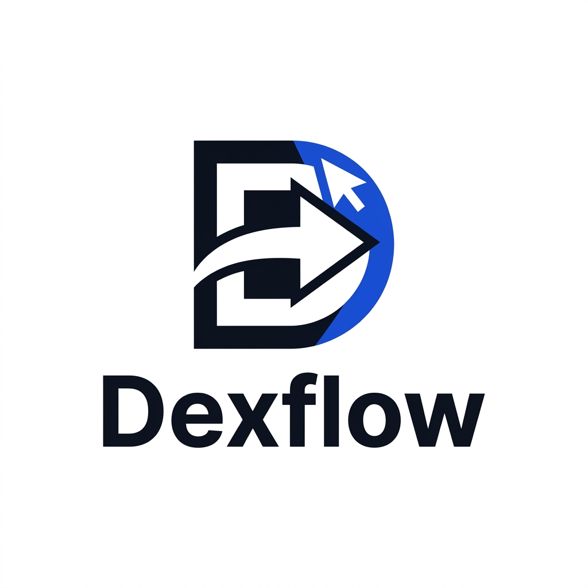
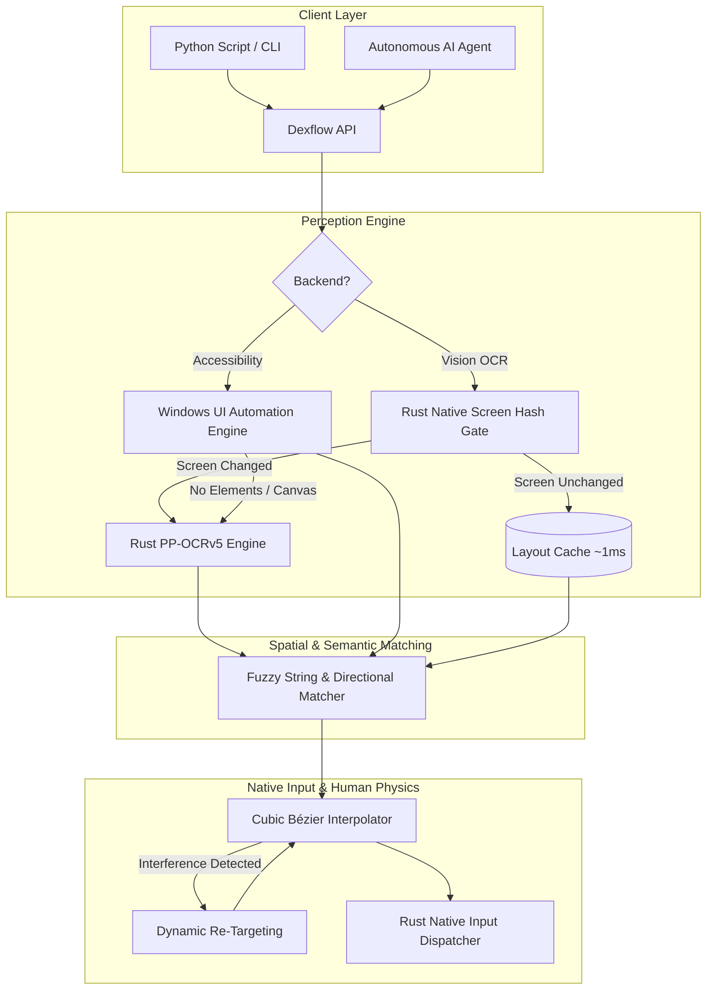

<p align="center">
  
</p>

<h1 align="center">Dexflow</h1>

<p align="center">
  <strong>High-Speed, Deterministic Desktop Automation & AI Agent Execution Layer for Python</strong>
</p>

<p align="center">
  <a href="https://pypi.org/project/dexflow/"></a>
  <a href="https://pypi.org/project/dexflow/"></a>
  <a href="https://github.com/kuntal-devrat/py-nerve/blob/main/LICENSE"></a>
  <a href="https://github.com/kuntal-devrat/py-nerve/actions"></a>
  
</p>

---

## ⚡ What is Dexflow?

**Dexflow** is a next-generation desktop automation framework and AI agent execution layer. 

Legacy automation tools rely on fragile, hardcoded pixel coordinates `(x, y)` or slow image-template matching that instantly break when screen resolutions, window sizes, or OS display scaling change. 

Dexflow provides **semantic, label-based desktop interaction**:
- 🎯 **Interact by text label:** `nv.click("Save")`, `nv.type_into("Search", "Query")`, `nv.click("Delete", relative_to="Invoice #102")`.
- 🦀 **Rust Core + SIMD PP-OCRv5:** Screenshot capture, sub-millisecond perceptual screen-hash caching, and batched OCR detection & recognition run natively in compiled Rust.
- 🪟 **Hybrid Perception:** Automatically uses Windows UI Automation (UIA) for instant, sub-10ms structural layout queries, with seamless zero-config fallback to local neural OCR.
- 🦾 **Human-Like Bézier Dynamics:** Moves the cursor along natural cubic Bézier trajectories with adaptive velocity and real-time **human interference detection** (pauses and recovers if you grab the physical mouse).
- 🤖 **Autonomous AI Agent System:** Built-in ReAct execution loop formatted specifically for local & cloud LLMs (Ollama, Groq, LM Studio, OpenAI, Claude) with structured visual row grouping, change diffs, and context compression.

---

## 🏗 Architecture



---

## 📊 Comparison: Why Dexflow?

| Feature | **Dexflow** | PyAutoGUI | SikuliX | Anthropic Computer Use | Open Interpreter |
|---|---|---|---|---|---|
| **Element Finding** | 🟢 **OCR + UIA + Fuzzy Match** | 🔴 Hardcoded pixel coords | 🟡 Image template matching | 🟡 Vision model pixel guessing | 🟡 Vision / script guessing |
| **Resilience to UI Changes** | 🟢 **High** (text & spatial layout) | 🔴 Breaks on any move/theme | 🟡 Breaks on scale/theme | 🟡 Hallucination-prone | 🟡 Fragile |
| **Perception Latency** | 🟢 **~1ms (cached) / <10ms (UIA)** | 🟢 0ms (no perception) | 🔴 Slow OpenCV template scan | 🔴 2-5s per action (API latency) | 🔴 2-5s per action |
| **Cost** | 🟢 **100% Free & Local** | 🟢 Free | 🟢 Free | 🔴 Expensive ($$$ per API call) | 🔴 API cost |
| **Mouse Dynamics** | 🟢 **Cubic Bézier (Human-like)** | 🔴 Linear instant jump | 🟡 Basic linear move | 🔴 Coordinate jumps | 🟡 Basic script exec |
| **Interference Detection**| 🟢 **Yes** (pauses & re-targets) | 🔴 No | 🔴 No | 🔴 No | 🔴 No |
| **Agent State Efficiency**| 🟢 **Compact visual rows + diffs** | ⚪ N/A (no agent) | ⚪ N/A (no agent) | 🔴 ~2K-4K tokens / image | 🔴 High |
| **Privacy & Offline** | 🟢 **100% Local / Air-gapped** | 🟢 Local | 🟢 Local | 🔴 Desktop images sent to cloud| 🟡 Dependent on LLM |

---

## 📦 Installation

```bash
# Core package (includes native Rust engine and bundled PP-OCRv5 models)
pip install dexflow

# Optional: Windows UI Automation accessibility backend
pip install "dexflow[accessibility]"
```

> **Note:** Neural OCR models (~8.5 MB) are pre-bundled inside the wheel. No separate model downloads or external tools required.

---

## 🚀 Quick Start

### 1. Simple Desktop Actions

```python
import dexflow as df

# Bring target window to focus
df.focus_window("Calculator")

# Click buttons directly by their on-screen labels
df.click("7")
df.click("+")
df.click("8")
df.click("=")

# Type into input fields
df.type_into("File name:", "Quarterly_Report.xlsx", clear=True)

# Hover and contextual clicks
df.hover("Help", dwell=0.5)
df.right_click("Document.txt")
df.double_click("Trash")
```

### 2. Relative & Spatial Positioning

When multiple UI elements have identical labels (e.g. repeated `"Edit"`, `"Delete"`, or `"Download"` buttons):

```python
# Click "Delete" specifically to the right of "Invoice #1094"
df.click("Delete", relative_to="Invoice #1094", direction="right")

# Click the input field positioned below the "Email" label
df.type_into("input", "user@example.com", relative_to="Email", direction="below")
```

*Supported directions:* `"right"`, `"left"`, `"above"`, `"below"`.

### 3. Window & Multi-Monitor Support

```python
# List connected monitors
monitors = df.list_monitors()
for idx, name, is_primary, (x, y, w, h) in monitors:
    print(f"Monitor {idx}: {name} ({w}x{h}) {'[Primary]' if is_primary else ''}")

# Capture screenshots and observe specific windows
img = df.capture_window("Notepad")
state = df.observe_window("Visual Studio Code")

# Native cross-platform clipboard
df.set_clipboard("Automated Text Payload")
print("Clipboard contents:", df.get_clipboard())
```

---

## 🤖 AI Desktop Agent Integration

Dexflow serves as the deterministic execution layer for Autonomous AI Agents. Use any OpenAI-compatible endpoint (local via Ollama / LM Studio or cloud via OpenRouter / Groq / OpenAI / Gemini):

```python
import dexflow as df

# One-shot desktop agent execution
result = df.run_agent(
    "Open Notepad, type a grocery list for tacos, and save the file to Desktop as tacos.txt",
    model="llama-3.3-70b-versatile",
    base_url="https://api.groq.com/openai/v1",
    api_key="gsk_...",
    dry_run=False,
    max_steps=25,
)

print("Agent Summary:", result.final_answer)
print(f"Executed in {result.steps} steps.")
```

### Interactive CLI Agent

Run the interactive CLI agent directly from your terminal:

```bash
# Safe preview mode (plans and logs actions without moving mouse)
python scripts/desktop_agent_cli.py --dry-run

# Run local task using Ollama
python scripts/desktop_agent_cli.py "Open Spotify and search for synthwave" --model llama3.2 --base-url http://localhost:11434/v1
```

---

## 📚 API Reference

### High-Level Actions

| Function | Description |
|---|---|
| `nv.click(text, **kwargs)` | Moves cursor along Bézier curve and left-clicks target label. |
| `nv.double_click(text, **kwargs)` | Moves cursor and double-clicks target label. |
| `nv.right_click(text, **kwargs)` | Moves cursor and right-clicks target label (opens context menus). |
| `nv.middle_click(text, **kwargs)` | Moves cursor and middle-clicks target label. |
| `nv.hover(text, dwell=0.2, **kwargs)`| Moves cursor to element and dwells without clicking. |
| `nv.type_into(text, content, **kwargs)` | Clicks an input field and types text (`clear=True` clears field first). |
| `nv.find(text, **kwargs)` | Locates element and returns `Element(text, confidence, center, bounds)`. |
| `nv.find_all(text, threshold=None)` | Locates all matching elements on screen. |
| `nv.wait_for(text, timeout=30)` | Waits dynamically until target text appears on screen. |
| `nv.scroll(amount, axis="vertical")` | Scrolls wheel (`positive=up`, `negative=down`, `axis="horizontal"`). |
| `nv.scroll_to(text, **kwargs)` | Scrolls mouse wheel incrementally until target element is visible. |
| `nv.drag_and_drop(source, target)` | Drags source element and drops it onto target element. |
| `nv.focus_window(title_substring)` | Finds and brings application window to the active foreground. |
| `nv.capture_window(title_substring)` | Takes screenshot strictly bounded to target application window. |
| `nv.observe(region=None)` | Returns structured layout snapshot of screen elements as plain dicts. |
| `nv.observe_window(title_substring)` | Returns structured layout snapshot constrained to window. |
| `nv.get_clipboard()` | Reads string text from OS clipboard. |
| `nv.set_clipboard(text)` | Writes string text to OS clipboard. |
| `nv.list_monitors()` | Lists all connected monitors and their geometries. |
| `nv.launch(app_or_url)` | Launches application, file, or URL using OS native launcher. |
| `nv.invalidate_cache()` | Clears cached screenshots and layout hashes. |

---

## 🏎 Performance & Benchmarks

Per-action latency benchmarks measured across diverse desktop environments:

| Screen Scenario | Perception Latency | Strategy |
|---|---|---|
| **Static Screen (Repeated lookup)** | **~1.1 ms** | Native perceptual screen-hash cache (no OCR) |
| **Windows UIA Desktop Walk** | **~4 - 9 ms** | Direct OS COM Accessibility Tree traversal |
| **Sparse Desktop (10-30 labels)** | **~95 - 140 ms** | Rust SIMD PP-OCRv5 mobile det + rec |
| **Complex Screen (100+ labels)** | **~380 - 750 ms** | Rust batched recognition across text crops |

---

## 🛠 Contributing & Development

### Prerequisites
- Python 3.10+
- Rust Toolchain (Cargo & rustc)

```bash
# Clone the repository
git clone https://github.com/kuntal-devrat/py-nerve.git
cd py-nerve

# Setup virtual environment
python -m venv .venv
.venv\Scripts\activate   # On Unix: source .venv/bin/activate

# Build Rust extension in development mode
pip install maturin pytest ruff mypy
maturin develop

# Run test suite
pytest tests/ -v
```

---

## 💬 Community & Feedback

> **Note (v0.1.1):** Dexflow is in active development. While the core engine and agent loop are thoroughly tested, dynamic SPAs, custom canvas controls, and multi-monitor edge cases can still present quirks. We'd love your bug reports, feature suggestions, and PRs!

---

## 📄 License

Distributed under the [MIT License](LICENSE).
